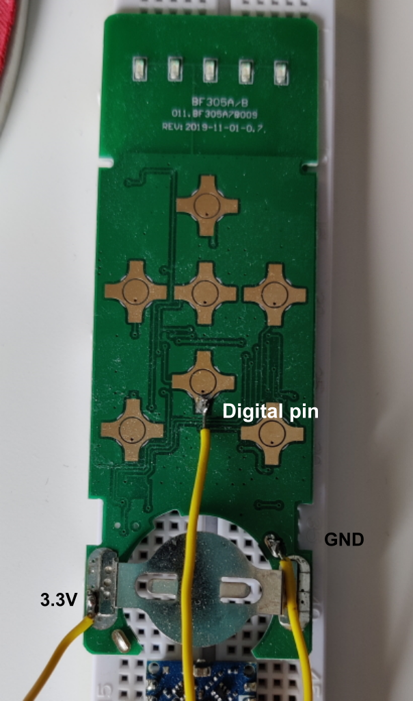

# Bliss remote actuator

Control a Bliss motor using a Bliss remote and an Arduino.

1. Flash the firmware in this folder.
2. Connect the wiring according to : 
3. Use the API as documented in the firmware to activate the remote buttons.
